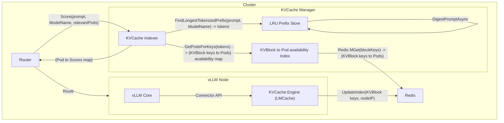

# KVCache Manager

## Introduction

LLM inference can be computationally expensive due to the sequential nature of token generation. 
KV-caching plays a critical role in optimizing this process. By storing previously computed key and value attention vectors, 
KVCache reuse avoids redundant computations during inference, significantly reducing latency and resource consumption. 
This is particularly beneficial for long context multi-turn conversations or Agentic (&RAG) applications where 
previously computed information can be leveraged effectively. 
Efficient KVCache management and routing are essential for scaling LLM inference and delivering a responsive user experience.

llmd-kv-cache-manager is a pluggable KVCache Manager for KVCache Aware Routing in vLLM-based serving platforms.

See [docs](docs/README.md) for more information on goals, architecture and more.
## Overview

The code defines a [KVCacheIndexer](pkg/kv-cache/indexer.go) module that efficiently maintains a global view of KVCache states and localities. 
In the current state of vLLM, the only available information on KVCache availability is that of the offloaded tensors to KVCache Engines via the Connector API.

The `kvcache.Indexer` module is a pluggable Go package designed for use by orchestrators to enable KVCache-aware scheduling decisions.

This overview greatly simplifies the actual architecture and combines steps across several submodules.
For a detailed architecture, refer to the [architecture](docs/architecture.md) document.

## Examples

- [KVCache Indexer](examples/kv-cache-index/README.md): 
  - A reference implementation of using the `kvcache.Indexer` module.
- [KVCache Aware Scorer](examples/kv-cache-aware-scorer/README.md): 
  - A reference implementation of integrating the `kvcache.Indexer` module in 
  [llm-d-inference-scheduler](https://github.com/llm-d/llm-d-inference-scheduler) in a KVCache aware scorer.

