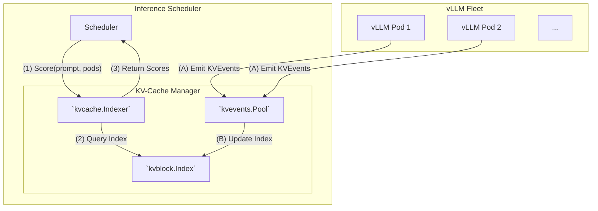

# KV-Cache Manager

### Introduction

Efficiently caching Key & Value (KV) tensors is crucial for optimizing LLM inference. 
Reusing the KV-Cache, rather than recomputing it, significantly improves both Time To First Token (TTFT) and overall throughput, while also maximizing system resource-utilization.
As a distributed LLM inference platform, `llm-d` provides a comprehensive suite of KV-Cache management capabilities to achieve these goals.

This repository contains the `llm-d-kv-cache-manager`, a pluggable service designed to enable **KV-Cache Aware Routing** and lay the foundation for advanced, cross-node cache coordination in vLLM-based serving platforms.

### Project Northstar

See the [Project Northstar](https://docs.google.com/document/d/1EM1QtDUaw7pVRkbHQFTSCQhmWqAcRPJugJgqPbvzGTA/edit?tab=t.ikcvw3heciha) document for a detailed overview of the project's goals and vision.

-----

## KV-Cache Indexer Overview

The major component of this project is the **KV-Cache Indexer** is a high-performance library that keeps a global, near-real-time view of KV-Cache block locality across a fleet of vLLM pods.

It is powered by `KVEvents` streamed from vLLM, which provide structured metadata as KV-blocks are created or evicted from a vLLM instance's KV-cache. 
This allows the indexer to track which blocks reside on which nodes and on which tier (e.g., GPU or CPU). 
This metadata is the foundation for intelligent routing, enabling schedulers to make optimal, KV-cache-aware placement decisions.

The diagram below shows the primary data flows: the **Read Path** (scoring) and the **Write Path** (event ingestion).

**Read Path:**
- (1)  **Scoring Request**: A scheduler asks the **KVCache Indexer** to score a set of pods for a given prompt
- (2)  **Index Query**: The indexer calculates the necessary KV-block keys from the prompt and queries the **KV-Block Index** to see which pods have those blocks
- (3)  **Return Scores**: The indexer returns a map of pods and their corresponding KV-cache-hit scores to the scheduler

**Write Path:**
- (A)  **Event Ingestion**: As vLLM pods create or evict KV-blocks, they emit `KVEvents` containing metadata about these changes
- (B)  **Index Update**: The **Event Subscriber** consumes these events and updates the **KV-Block Index** in near-real-time

> For a more detailed breakdown, please see the high-level [Architecture](docs/architecture.md) and the [Configuration](docs/configuration.md) docs.

-----

### Examples

* [**KVCache Indexer**](examples/kv_cache_index/README.md):
  A reference implementation showing how to run and use the `kvcache.Indexer` module
* [**KVCache Aware Scorer**](examples/kv_cache_aware_scorer/README.md):
  A reference implementation of how to integrate the `kvcache.Indexer` into a scheduler like the `llm-d-inference-scheduler`
* [**KV-Events**](examples/kv_events/README.md):
 Demonstrates how the KV-Cache Manager handles KV-Events through both an offline example with a dummy ZMQ publisher and an online example using a vLLM Helm chart.
