# Inference-Perf Benchmark Report

This benchmark report compares the performance of the different llm-d well-lit scheduling strategies (default + precise), along with load-based and random scheduling.

The setup uses 4 vLLM pods running the `meta-llama/Llama-3.1-70B-Instruct` model, each with 4 H100 GPUs (Tensor-Parallelism=4).

The workload is described below.

### Workload profile

```yaml
# X-37 — Long prefix (~8k), output=1000, 63% under-fill, Poisson arrivals
#
# FIXED (per pod)
# - KV_cap (effective, min TP rank): 461,376 tokens
# - Prompt shape:
#     L_shared   = 8,000      # long system prompt
#     L_question = 1,000      # unique per request
#     L_output   = 1,000  → live decode L_live ≈ 500 (streaming steady-state)
#
# CONCURRENCY ASSUMPTION (for slot math)
# - Take C ≈ 8 in-flight / pod at the higher stages
#
# CAPACITY → SLOTS (include decode + unique question in ephemeral)
# - Ephemeral per request      = L_question + L_live = 1,000 + 500 = 1,500
# - Ephemeral per pod          = C * 1,500 = 8 * 1,500 = 12,000
# - Remaining KV per pod       = 461,376 − 12,000 = 449,376
# - Slots per pod              = floor(449,376 / 8,000) = 56
# - Slots cluster-wide (4 pods)= 4 * 56 = 224
#
# WORKING SET & OVERFILL
# - num_groups (distinct prefixes) G = 83
# - Overfill% = (G − slots_cluster) / slots_cluster × 100
#              = (83 − 224) / 224 * 100 ≈ -63% (under-fill)
# - num_prompts_per_group P = 3 → One FULL SET S = G * P = 83 * 3 = 249 requests
#
# SENSITIVITY NOTE (if concurrency rises to C=10):
# - Ephemeral/pod = 15,000 → Remaining/pod = 446,376 → Slots/pod = 55 → Slots/cluster = 220
#
load:
  type: constant
  stages:
    - rate: 9         # warmup
      duration: 30
    - rate: 3
      duration: 210
    - rate: 4
      duration: 180
    - rate: 5
      duration: 120
    - rate: 6
      duration: 120
    - rate: 8
      duration: 90
    - rate: 10
      duration: 70
    - rate: 12
      duration: 60
    - rate: 15
      duration: 50
    - rate: 20
      duration: 50
api:
  type: completion
  streaming: true

server:
  type: vllm
  model_name: meta-llama/Llama-3.1-70B-Instruct
  base_url: <endpoint>
  ignore_eos: true

tokenizer:
  pretrained_model_name_or_path: meta-llama/Llama-3.1-70B-Instruct

data:
  type: shared_prefix
  shared_prefix:
    num_groups: 83
    num_prompts_per_group: 3
    system_prompt_len: 8000
    question_len: 1000
    output_len: 1000

report:
  request_lifecycle:
    summary: true
    per_stage: true
    per_request: true

storage:
  local_storage:
    path: /workspace
```

### Scheduler Configurations

**default-scheduling**

```yaml
apiVersion: inference.networking.x-k8s.io/v1alpha1
kind: EndpointPickerConfig
plugins:
- type: queue-scorer
- type: kv-cache-scorer
- type: prefix-cache-scorer
- type: max-score-picker
  parameters:
    maxNumOfEndpoints: 1
- type: single-profile-handler
schedulingProfiles:
- name: default
  plugins:
  - pluginRef: queue-scorer
    weight: 1
  - pluginRef: kv-cache-scorer
    weight: 1
  - pluginRef: prefix-cache-scorer
    weight: 2
  - pluginRef: max-score-picker
```

**load-scheduling**

```yaml
apiVersion: inference.networking.x-k8s.io/v1alpha1
kind: EndpointPickerConfig
plugins:
- type: queue-scorer
- type: kv-cache-scorer
- type: max-score-picker
  parameters:
    maxNumOfEndpoints: 1
- type: single-profile-handler
schedulingProfiles:
- name: default
  plugins:
  - pluginRef: queue-scorer
    weight: 1
  - pluginRef: kv-cache-scorer
    weight: 1
  - pluginRef: max-score-picker
```

**precise-scheduling**

```yaml
apiVersion: inference.networking.x-k8s.io/v1alpha1
kind: EndpointPickerConfig
plugins:
- type: single-profile-handler
- type: prefix-cache-scorer
  parameters:
    mode: cache_tracking
    indexerConfig:
      tokenProcessorConfig:
        blockSize: 64   
        hashSeed: "42"
      kvBlockIndexConfig:
        enableMetrics: true    
        metricsLoggingInterval: 60000000000 
- type: kv-cache-scorer
- type: queue-scorer
- type: max-score-picker
schedulingProfiles:
- name: default
  plugins:
    - pluginRef: prefix-cache-scorer
      weight: 2.0
    - pluginRef: kv-cache-scorer
      weight: 1.0
    - pluginRef: queue-scorer
      weight: 1.0
    - pluginRef: max-score-picker
```

**random-scheduling**

```yaml
apiVersion: inference.networking.x-k8s.io/v1alpha1
kind: EndpointPickerConfig
plugins:
- type: single-profile-handler
- type: random-picker
schedulingProfiles:
- name: default
  plugins:
    - pluginRef: random-picker
```

## Charts

### Latency vs QPS

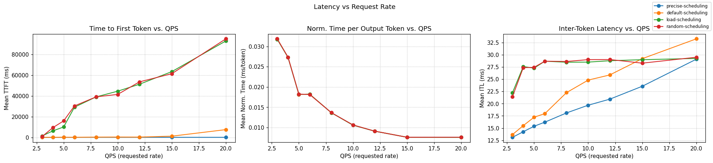

### Throughput vs QPS

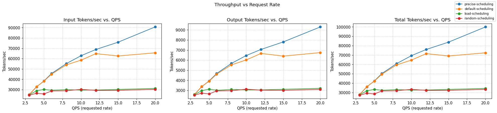

### TTFT p90 vs QPS

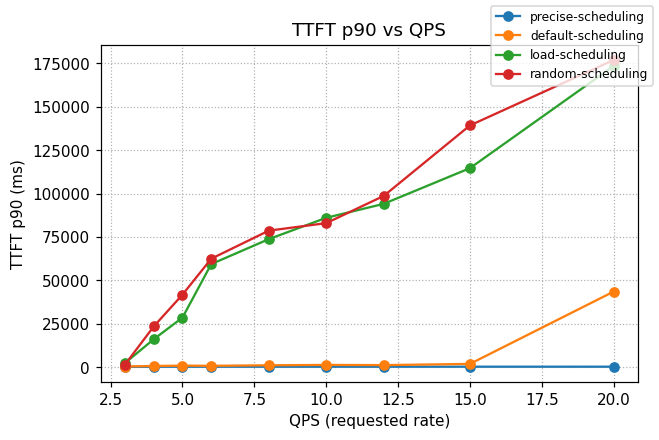

### Waiting Queue vs Time

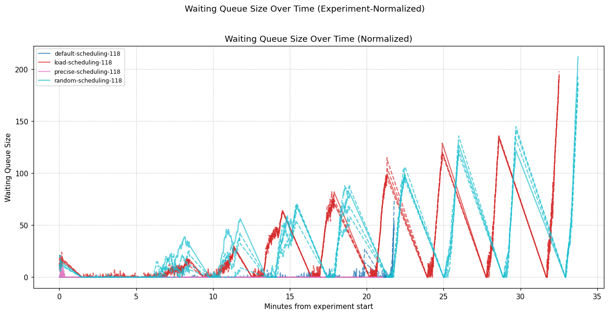

### KV Cache Usage vs Time

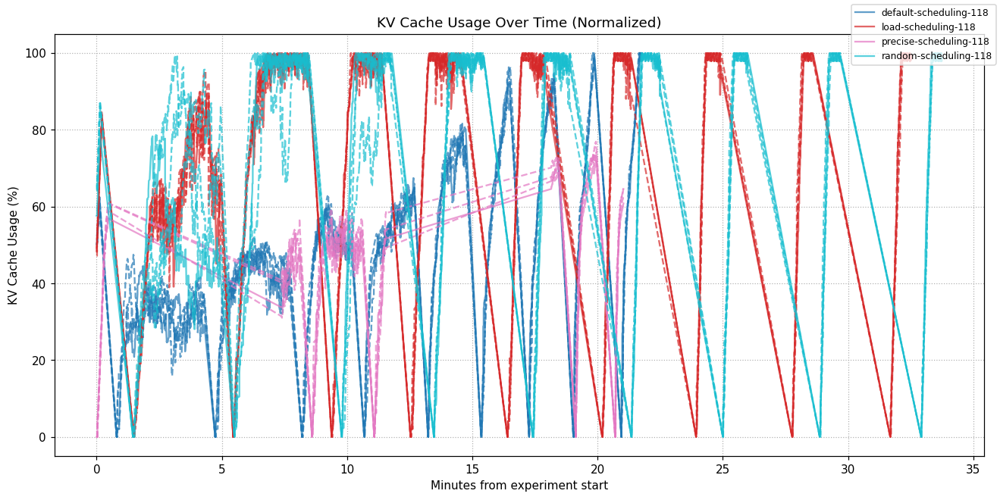

### EPP Metrics Comparative Analysis

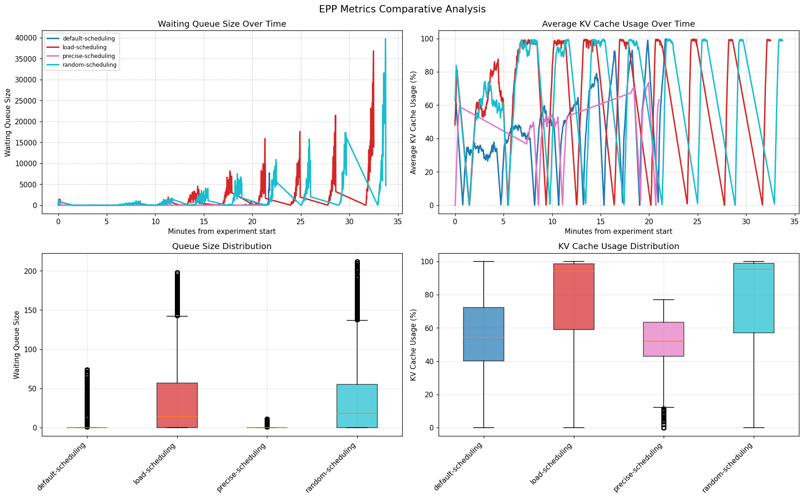

### How to read this report (quick)

- **Output tokens/sec** is the primary throughput metric (higher is better).

- **Requests/sec** shows the rate of completed requests.

- **Success Rate** reflects outcome quality, not volume.

- **TTFT** is time to first token; **ITL** is the gap between tokens (both lower is better).

- **Queue sizes** and **KV cache usage** show resource utilization patterns.


### Summary across QPS


| Experiment | Output toks/s | Requests/s | Success Rate | TTFT p90 (s) | TTFT mean (s) | ITL mean (s) | ITL p50/ p90 (s) |
|---|---:|---:|---:|---:|---:|---:|---:|
| precise-scheduling | 5650.0 | 6.914 | 100.00% | 0.275 | 0.193 | 0.020 | 0.0000/0.085 |
| default-scheduling | 5096.2 | 6.915 | 100.00% | 7.536 | 1.549 | 0.023 | 0.0000/0.093 |
| load-scheduling | 3018.3 | 6.920 | 100.00% | 78.303 | 41.058 | 0.028 | 0.0000/0.062 |
| random-scheduling | 2895.4 | 6.914 | 100.00% | 84.623 | 42.011 | 0.028 | 0.0000/0.061 |

### EPP Queue and KV Cache Metrics Summary


| Experiment | Wait Queue (mean/p90/max) | KV Cache % (mean/p90/max) | Pods | Data Points |
|---|---:|---:|---:|---:|
| default-scheduling | 0.9/0/74 | 55.3/87.0/100.0 | 4 | 53096 |
| load-scheduling | 34.2/97/198 | 76.2/99.6/100.0 | 4 | 53344 |
| precise-scheduling | 0.2/0/11 | 49.8/70.5/76.9 | 4 | 20824 |
| random-scheduling | 34.9/98/212 | 76.5/99.6/100.0 | 4 | 53024 |

## Per-QPS Results


### QPS = 3.0


| Experiment | Output toks/s | Requests/s | Success Rate | TTFT p90 (s) | TTFT mean (s) | ITL mean (s) | ITL p50/ p90 (s) |
|---|---:|---:|---:|---:|---:|---:|---:|
| precise-scheduling | 2579.8 | 3.003 | 100.00% | 0.201 | 0.144 | 0.013 | 0.0000/0.087 |
| default-scheduling | 2595.6 | 3.004 | 100.00% | 0.399 | 0.207 | 0.014 | 0.0000/0.092 |
| random-scheduling | 2518.0 | 3.003 | 100.00% | 1.502 | 0.852 | 0.021 | 0.0000/0.088 |
| load-scheduling | 2567.1 | 3.010 | 100.00% | 2.400 | 1.443 | 0.022 | 0.0000/0.100 |

### QPS = 4.0


| Experiment | Output toks/s | Requests/s | Success Rate | TTFT p90 (s) | TTFT mean (s) | ITL mean (s) | ITL p50/ p90 (s) |
|---|---:|---:|---:|---:|---:|---:|---:|
| precise-scheduling | 3366.8 | 4.007 | 100.00% | 0.277 | 0.182 | 0.014 | 0.0000/0.078 |
| default-scheduling | 3386.2 | 4.000 | 100.00% | 0.700 | 0.236 | 0.015 | 0.0000/0.094 |
| load-scheduling | 2974.3 | 4.004 | 100.00% | 16.101 | 6.367 | 0.028 | 0.0000/0.100 |
| random-scheduling | 2734.2 | 4.002 | 100.00% | 23.480 | 9.475 | 0.027 | 0.0000/0.088 |

### QPS = 5.0


| Experiment | Output toks/s | Requests/s | Success Rate | TTFT p90 (s) | TTFT mean (s) | ITL mean (s) | ITL p50/ p90 (s) |
|---|---:|---:|---:|---:|---:|---:|---:|
| precise-scheduling | 3940.5 | 5.017 | 100.00% | 0.281 | 0.188 | 0.015 | 0.0000/0.079 |
| default-scheduling | 3912.1 | 5.021 | 100.00% | 0.900 | 0.307 | 0.017 | 0.0000/0.096 |
| load-scheduling | 3119.7 | 5.004 | 100.00% | 28.581 | 10.158 | 0.027 | 0.0000/0.100 |
| random-scheduling | 2647.1 | 4.997 | 100.00% | 41.795 | 15.998 | 0.027 | 0.0000/0.086 |

### QPS = 6.0


| Experiment | Output toks/s | Requests/s | Success Rate | TTFT p90 (s) | TTFT mean (s) | ITL mean (s) | ITL p50/ p90 (s) |
|---|---:|---:|---:|---:|---:|---:|---:|
| precise-scheduling | 4665.9 | 6.000 | 100.00% | 0.281 | 0.195 | 0.016 | 0.0000/0.081 |
| default-scheduling | 4604.2 | 6.000 | 100.00% | 0.794 | 0.254 | 0.018 | 0.0000/0.096 |
| load-scheduling | 3007.5 | 6.005 | 100.00% | 59.389 | 29.175 | 0.029 | 0.0000/0.087 |
| random-scheduling | 2946.7 | 6.031 | 100.00% | 62.490 | 30.389 | 0.029 | 0.0000/0.080 |

### QPS = 8.0


| Experiment | Output toks/s | Requests/s | Success Rate | TTFT p90 (s) | TTFT mean (s) | ITL mean (s) | ITL p50/ p90 (s) |
|---|---:|---:|---:|---:|---:|---:|---:|
| precise-scheduling | 5675.9 | 8.008 | 100.00% | 0.280 | 0.199 | 0.018 | 0.0000/0.084 |
| default-scheduling | 5529.6 | 8.017 | 100.00% | 1.110 | 0.399 | 0.022 | 0.0000/0.099 |
| load-scheduling | 3089.7 | 8.009 | 100.00% | 73.762 | 39.076 | 0.028 | 0.0000/0.040 |
| random-scheduling | 2968.5 | 8.008 | 100.00% | 78.656 | 39.117 | 0.029 | 0.0000/0.039 |

### QPS = 10.0


| Experiment | Output toks/s | Requests/s | Success Rate | TTFT p90 (s) | TTFT mean (s) | ITL mean (s) | ITL p50/ p90 (s) |
|---|---:|---:|---:|---:|---:|---:|---:|
| precise-scheduling | 6456.9 | 10.000 | 100.00% | 0.282 | 0.202 | 0.020 | 0.0000/0.088 |
| default-scheduling | 6021.8 | 10.013 | 100.00% | 1.309 | 0.466 | 0.025 | 0.0000/0.096 |
| random-scheduling | 3119.5 | 10.014 | 100.00% | 83.002 | 41.480 | 0.029 | 0.0000/0.068 |
| load-scheduling | 3050.4 | 10.057 | 100.00% | 86.063 | 44.587 | 0.028 | 0.0000/0.039 |

### QPS = 12.0


| Experiment | Output toks/s | Requests/s | Success Rate | TTFT p90 (s) | TTFT mean (s) | ITL mean (s) | ITL p50/ p90 (s) |
|---|---:|---:|---:|---:|---:|---:|---:|
| precise-scheduling | 7062.0 | 12.036 | 100.00% | 0.282 | 0.202 | 0.021 | 0.0000/0.085 |
| default-scheduling | 6667.0 | 12.018 | 100.00% | 1.199 | 0.420 | 0.026 | 0.0000/0.094 |
| load-scheduling | 3044.0 | 12.018 | 100.00% | 94.109 | 51.247 | 0.029 | 0.0000/0.039 |
| random-scheduling | 3022.5 | 12.020 | 100.00% | 98.661 | 53.513 | 0.029 | 0.0000/0.039 |

### QPS = 15.0


| Experiment | Output toks/s | Requests/s | Success Rate | TTFT p90 (s) | TTFT mean (s) | ITL mean (s) | ITL p50/ p90 (s) |
|---|---:|---:|---:|---:|---:|---:|---:|
| precise-scheduling | 7807.3 | 14.994 | 100.00% | 0.288 | 0.210 | 0.024 | 0.0000/0.079 |
| default-scheduling | 6401.2 | 15.001 | 100.00% | 1.900 | 1.294 | 0.029 | 0.0000/0.084 |
| load-scheduling | 3106.0 | 15.027 | 100.00% | 114.672 | 63.407 | 0.029 | 0.0000/0.038 |
| random-scheduling | 3003.1 | 15.028 | 100.00% | 139.286 | 61.425 | 0.028 | 0.0000/0.037 |

### QPS = 20.0


| Experiment | Output toks/s | Requests/s | Success Rate | TTFT p90 (s) | TTFT mean (s) | ITL mean (s) | ITL p50/ p90 (s) |
|---|---:|---:|---:|---:|---:|---:|---:|
| precise-scheduling | 9295.2 | 20.003 | 100.00% | 0.290 | 0.201 | 0.029 | 0.0000/0.100 |
| default-scheduling | 6748.0 | 20.040 | 100.00% | 43.568 | 7.609 | 0.033 | 0.0000/0.089 |
| load-scheduling | 3205.6 | 20.080 | 100.00% | 173.540 | 92.947 | 0.029 | 0.0000/0.038 |
| random-scheduling | 3099.1 | 20.002 | 100.00% | 176.975 | 94.952 | 0.029 | 0.0000/0.037 |

## Per-Pod EPP Metrics

Individual pod metrics over the duration of each experiment.


### Experiment: default-scheduling

**Pod:** `default-scheduling_10_132_0_118`


**Pod:** `default-scheduling_10_132_0_119`

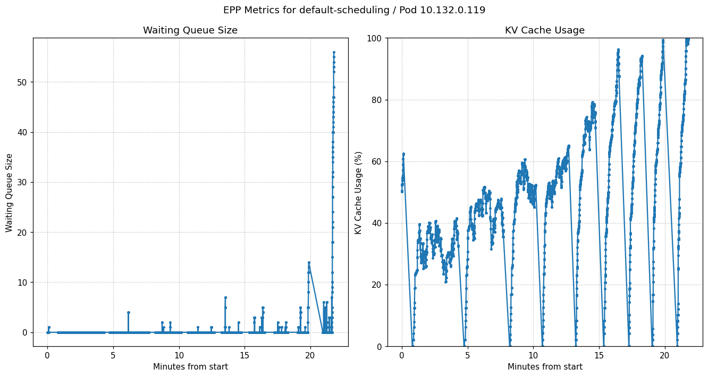

**Pod:** `default-scheduling_10_134_0_174`

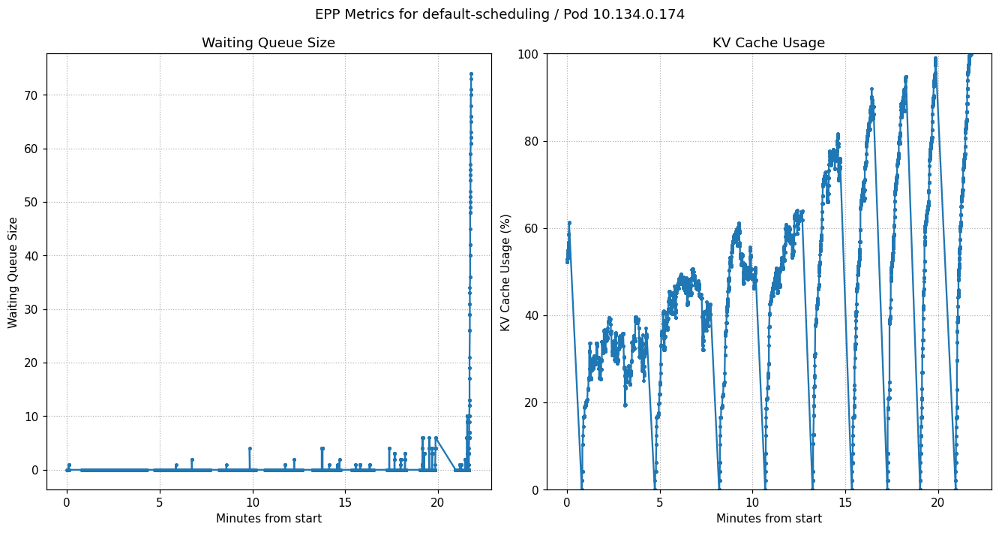

**Pod:** `default-scheduling_10_135_0_177`

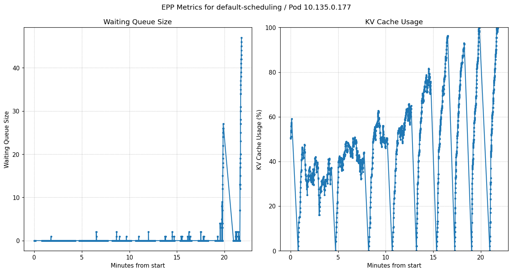


### Experiment: load-scheduling

**Pod:** `load-scheduling_10_132_0_118`

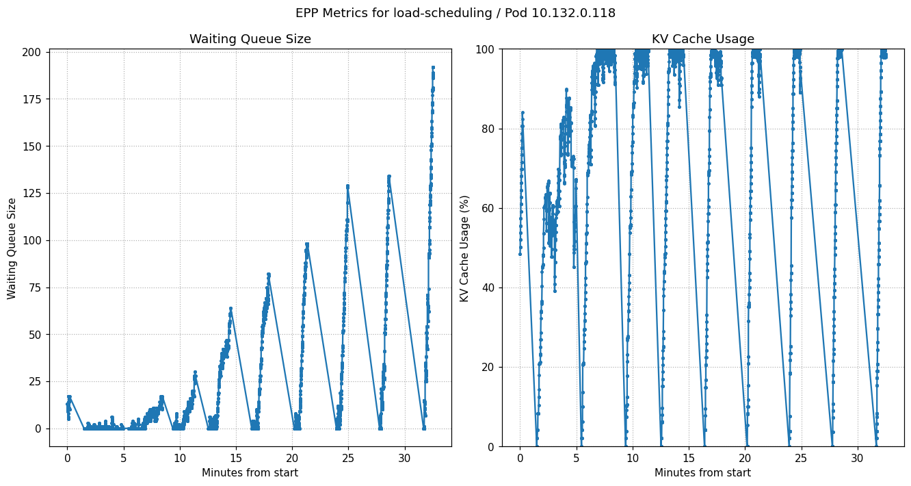

**Pod:** `load-scheduling_10_132_0_119`


**Pod:** `load-scheduling_10_134_0_174`


**Pod:** `load-scheduling_10_135_0_177`

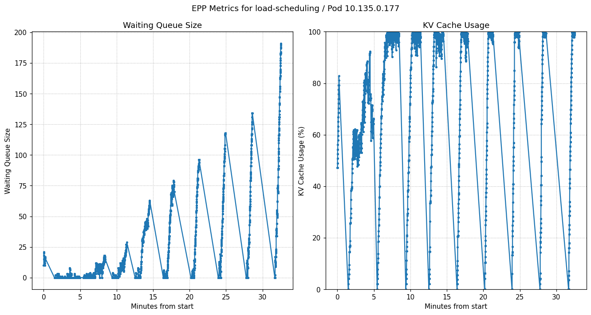


### Experiment: precise-scheduling

**Pod:** `precise-scheduling_10_132_0_118`


**Pod:** `precise-scheduling_10_132_0_119`

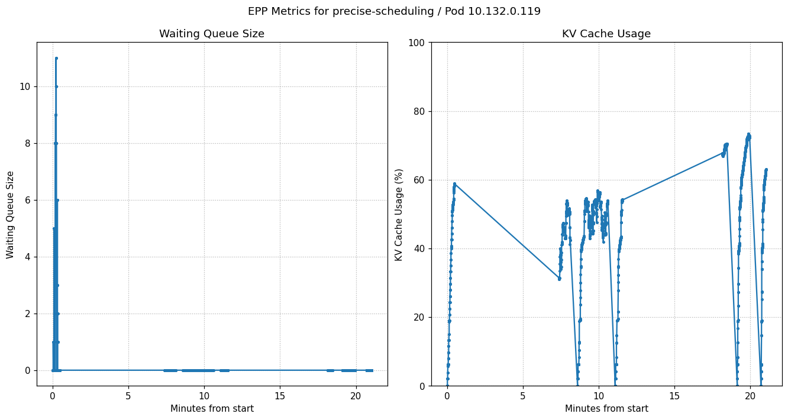

**Pod:** `precise-scheduling_10_134_0_174`


**Pod:** `precise-scheduling_10_135_0_177`

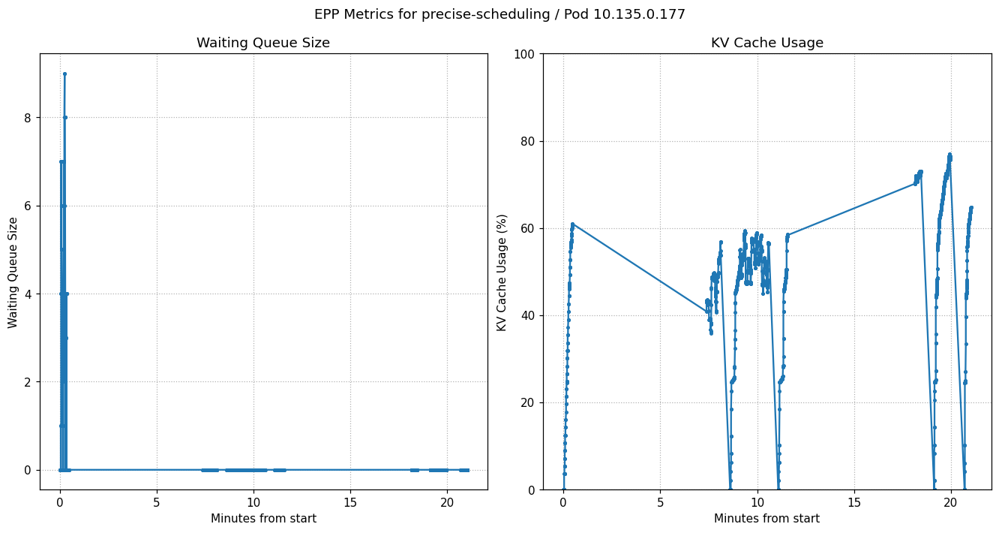


### Experiment: random-scheduling

**Pod:** `random-scheduling_10_132_0_118`

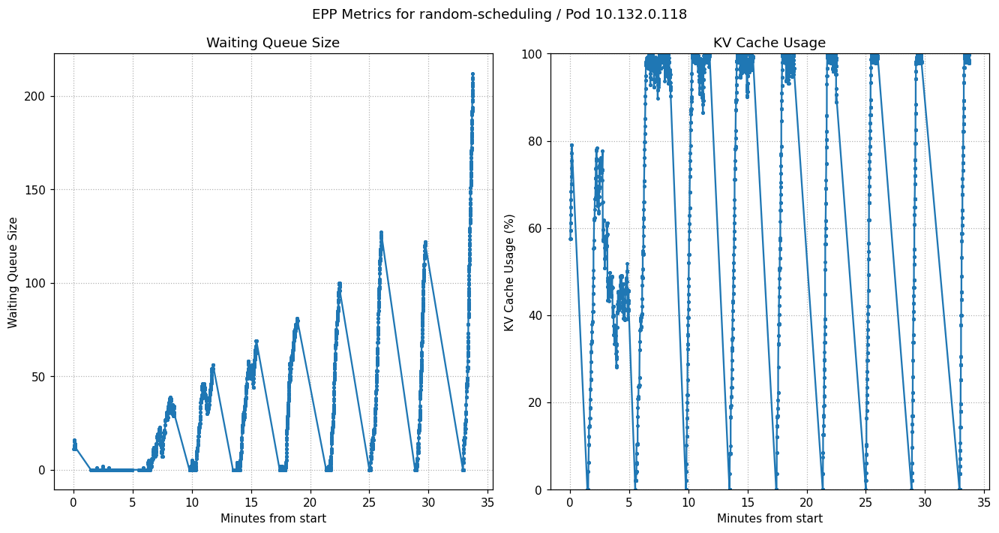

**Pod:** `random-scheduling_10_132_0_119`

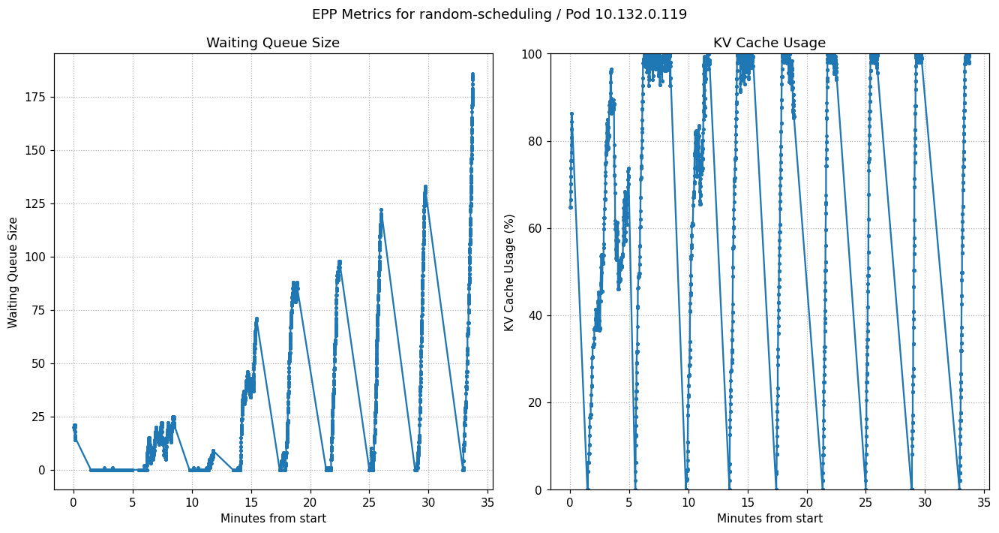

**Pod:** `random-scheduling_10_134_0_174`

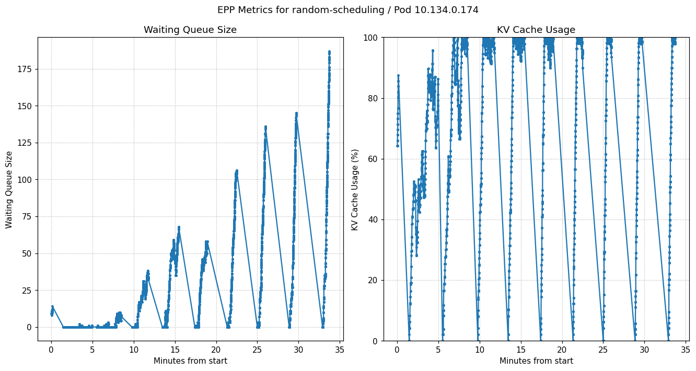

**Pod:** `random-scheduling_10_135_0_177`

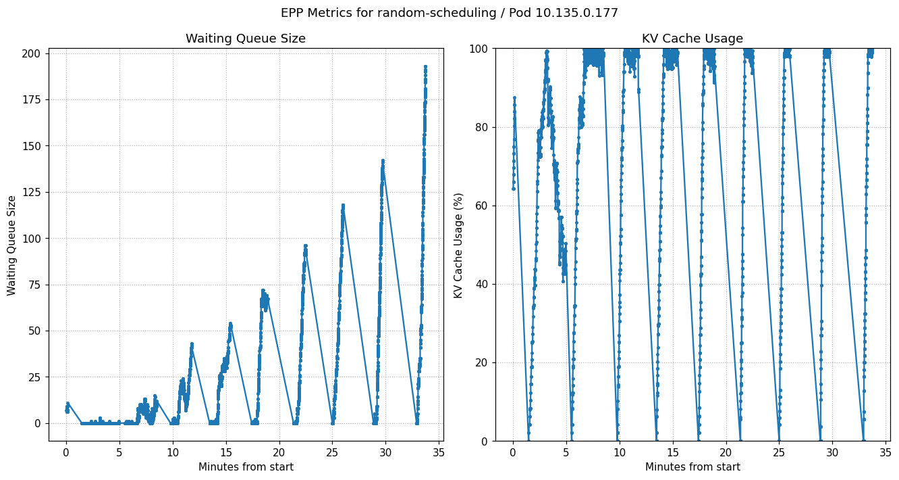
