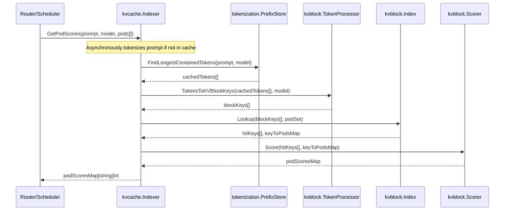
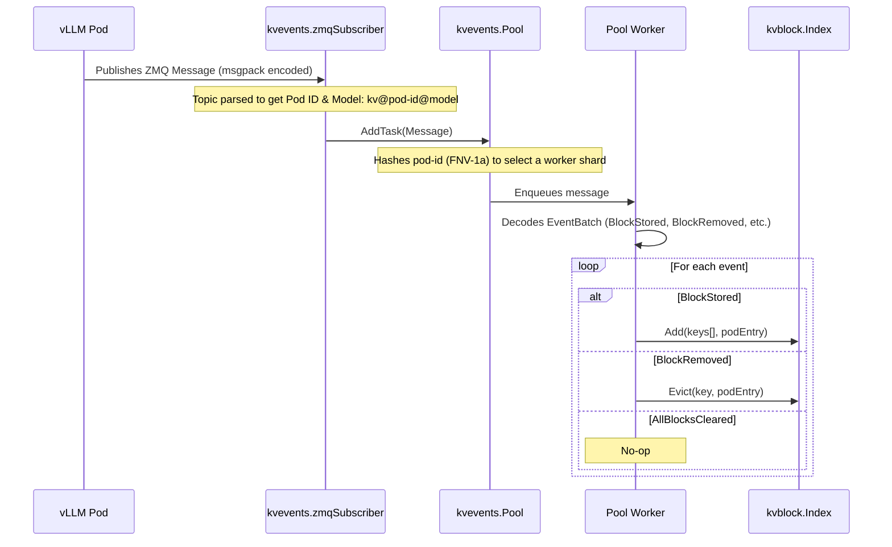

# KV-Cache Indexer: Architecture

The **KV-Cache Indexer** is a high-performance library that keeps a global, near-real-time view of KV-Cache block locality across a fleet of vLLM pods. 
Its purpose is the enablement of smart routing and scheduling by exposing a fast, intelligent scoring mechanism for vLLM pods based on their cached KV-blocks.

-----

## System Architecture

The Indexer is built from several modules that work together, each with clear responsibilities.
Separating concerns is a guiding principle in the design of this system.

| Module | Purpose                                                      | Default Implementation                                          |
| :--- |:-------------------------------------------------------------|:----------------------------------------------------------------|
| **`kvcache.Indexer`** | The main orchestrator that handles scoring requests          | Coordinates all internal modules                                |
| **`kvevents.Pool`** | Ingests and processes KV-cache events from vLLM pods         | A sharded worker pool using ZMQ for event subscription          |
| **`kvblock.Index`** | The core data store mapping KV-block hashes to pod locations | An in-memory, two-level LRU cache                               |
| **`tokenization.PrefixStore`**| Caches tokenized prompt prefixes to avoid re-work            | An LRU cache storing text chunks and their corresponding tokens |
| **`kvblock.TokenProcessor`**| Converts token sequences into KV-block keys                  | Uses a chunking and hashing algorithm compatible with vLLM      |
| **`kvblock.Scorer`** | Scores pods based on the sequence of cache hits              | Implements a longest consecutive prefix matching strategy       |

-----

## Data Flow & Processes

The system has two primary data flows: the **Read Path** for scoring pods and the **Write Path** for ingesting cache events.

### Read Path: Scoring a Prompt

When a router needs to pick the best pod for a new prompt, it triggers the Read Path. 
The goal is to find the pod that has the longest sequence of relevant KV-blocks already in its cache.
A list of pods with their scores is returned to the router.

**Key Steps:**

1.  **Token Retrieval**: The `Indexer` first checks the `PrefixStore` for the longest token sequence it has for the prompt's prefix. If the prompt isn't known, it's queued for background tokenization.
2.  **Key Generation**: The retrieved tokens are sent to the `TokenProcessor`, which chunks and hashes them into a sequence of deterministic KV-block keys that match vLLM's logic.
3.  **Index Lookup**: With the keys, the `Indexer` queries the `kvblock.Index` to see which pods have them. The lookup is optimized to find the longest *consecutive* chain of hits from the start.
4.  **Scoring**: The `Scorer` takes the hit data and scores each pod based on its number of consecutive matching blocks.
5.  **Response**: A final map of pod scores is sent back to the router.

Note: step (1) means that the first time a prompt is scored, it may return an empty result while the tokenization happens in the background.
It is assumed that this cache will be populated with common prompts, so the first scoring request is an edge case.

### Write Path: Processing Cache Events

The Write Path keeps the index up-to-date by processing a constant stream of events from the vLLM fleet.

**Key Steps:**

1.  **Event Publication**: A vLLM pod emits an event, like `BlockStored`, when its cache changes. The event is published to a ZMQ topic.
2.  **Message Reception**: The `zmqSubscriber` receives the message and parses the topic to get the `podIdentifier` and `modelName`.
3.  **Sharded Queuing**: The message goes to the `kvevents.Pool`, where the pod identifier is hashed (using FNV-1a) to select a specific worker queue. This guarantees that events from the same pod are always processed in order.
4.  **Event Decoding**: A worker pulls the message and decodes the msgpack payload, which can contain a batch of events.
5.  **Index Update**: The worker applies the event to the `kvblock.Index`, either adding a new block location or evicting an old one.

-----

## Component Deep Dives

#### KV-Block Hashing & Generation

To guarantee compatibility, the indexer perfectly matches vLLM's content-addressing logic.

* **Token Chunking**: Prompts are converted to tokens, which are then grouped into fixed-size chunks (default: 16).
* **Hash Algorithm**: A chained hash is computed. Each block's key is the **lower 64 bits of a SHA-256 hash**, generated from the CBOR-encoded `[parentHash, tokenChunk, extraKeys]` tuple.
* **Initialization**: The hash chain starts with a configurable `HashSeed`. This value's source **must** align with the `PYTHONHASHSEED` environment variable in the vLLM pods to ensure hashes are consistent across the entire system.

#### Index Backends

The `kvblock.Index` is an interface with swappable backends.

* **In-Memory (Default)**: A very fast, thread-safe, two-level LRU cache using `hashicorp/golang-lru`. The first level maps a block key to a second-level cache of pods that have the block. It prioritizes speed over persistence, which is usually the right trade-off for ephemeral cache data.
* **Redis (Optional)**: A distributed backend that can be shared by multiple indexer replicas. It can offer scalability and persistence, but this may be overkill given the short lifetime of most KV-cache blocks.

#### Tokenization Subsystem

Efficiently handling tokenization is critical for performance. The system is designed to tokenize prompts quickly without blocking scoring requests. It relies on a `PrefixStore` to cache tokenization results and an asynchronous `Pool` to process new, unseen prompts.

* **Async Tokenization Pool**: When a scoring request arrives with a prompt that isn't in the `PrefixStore`, the system doesn't wait. Instead, it immediately returns an empty result for that prompt and adds a tokenization task to a background worker pool (`tokenization.Pool`). This ensures that the scoring endpoint remains fast and responsive. The pool uses a configurable number of workers to process the queue.
* **Tokenizer Caching**: The actual tokenization is handled by a `CachedHFTokenizer`, which wraps Hugging Face's high-performance Rust tokenizers. To avoid the overhead of repeatedly loading tokenizer models from disk, it maintains an LRU cache of active tokenizer instances.
* **PrefixStore Backends**: The token cache (`PrefixStore`) is an interface with two available implementations:
    * **`LRUTokenStore` (Default)**: This implementation chunks incoming text, hashes it, and stores blocks of tokens in an LRU cache. It's fast and memory-bounded, making it a reliable default. It's designed to find the longest chain of *blocks* that match a prompt's prefix.
    * **`TrieTokenStore`**: An alternative implementation that uses a character-based trie. Each node in the trie stores information about the last token that was fully contained within the prefix leading to that node. This approach can be more memory-efficient for prompts with highly repetitive or overlapping prefixes, but is generally slower than the LRU-based store. 
    It is not the default due to its higher complexity and lower performance in most scenarios.

-----

## Dependencies

The Indexer relies on several libraries and tools:
* **[daulet/tokenizers](https://github.com/daulet/tokenizers)**: Go bindings for the HuggingFace Tokenizers library.
  * Used for tokenization of prompts. 
* **[pebbe/zmq4](https://github.com/pebbe/zmq4)**: Go bindings for ZeroMQ.
  * Used for the event processing pool and communication between components.
  * Requires `libzmq` library to be installed on the system.
* **Python**: Required to run a CGO binding for the `chat_completions_template` package.
  * Used for jinja2 templating of chat completions requests.