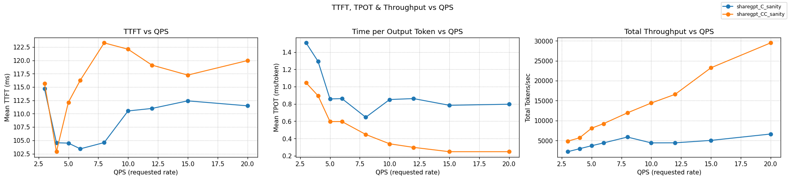

# Chat ChatTemplate Integration for OpenAI-API v1/chat/completions Compatibility

> Note: this does not support multi-modality at this point.

## Why Templating is Needed

When processing OpenAI ChatCompletions requests, vLLM templates the input before tokenization. 
For KV-cache lookups to work correctly, we must replicate this templating process in our indexer.

**Example:**
```json
{
  "messages": [
    {"role": "user", "content": "What's 2+2?"},
    {"role": "assistant", "content": "Let me calculate that."},
    {"role": "user", "content": "Thanks!"}
  ]
}
```

```jinja2
<!-- Model template (e.g., Llama-2) -->


{{ '<s>[INST] ' + message['content'] + ' [/INST]' }}

{{ message['content'] + '</s>' }}


```

```text
<!-- Flattened prompt the model actually sees -->
<s>[INST] What's 2+2? [/INST]Let me calculate that.</s><s>[INST] Thanks! [/INST]
```

**Without templating**, we'd not be able to recreate the same tokens vLLM will produce, leading to incorrect KV-cache lookups.

## Integration with Existing Pipeline

This package provides a library to be used for templating before using the `kvcache.Indexer` entry point.

### Request Structures

The following is the major request structure used for templating:
- Some fields are provided by the router (serving vLLM's OpenAI-compatible API).
- Some fields are fetched from the model's tokenizer (e.g., chat template).

The `RenderJinjaTemplateRequest` matches the `transformers` library's `ChatTemplateRequest` structure, which is used to render the chat template.

**RenderJinjaTemplateRequest accepts these fields, that match the `render_jinja_template`'s expected parameters:**
- `Conversations` - List of message lists (role/content pairs)
- `Tools` - (Optional) List of tool schemas
- `Documents` - (Optional) List of document dicts
- `ChatTemplate` - (Optional) Override for the chat template
- `ReturnAssistantTokensMask` - (Optional) Whether to return assistant token indices
- `ContinueFinalMessage` - (Optional) Whether to continue from the final message
- `AddGenerationPrompt` - (Optional) Whether to add a generation prompt
- `ChatTemplateKWArgs` - (Optional) Extra parameters for template rendering

See the transformers library's [code documentation](https://github.com/huggingface/transformers/blob/242bb2cafccec9f90479f5f688bca9d240b1031f/src/transformers/processing_utils.py#L390).
And the vLLM OpenAI API [documentation](https://docs.vllm.ai/en/latest/serving/openai_compatible_server.html#extra-parameters_1).

### ChatTemplate Processing Flow

The templating process (steps 1.1-1.4) handles the conversion from structured request to flattened prompt:

```
1.1. **CGO Binding**: chattemplatego.NewChatTemplatingProcessor()
    └── cgo_functions.go:NewChatTemplatingProcessor()
        └── Creates ChatTemplatingProcessor struct with initialized=false

1.2. **ChatTemplate Fetching**: wrapper.FetchChatTemplate(ctx, getReq)
    ├── cgo_functions.go:FetchChatTemplate(ctx, req)
    │   ├── Initialize() Python interpreter via CGO
    │   ├── executePythonCode() - **CGO Binding** to Python
    │   └── **Python Wrapper**: render_jinja_template_wrapper.py:get_model_chat_template()
    │       └── Uses Hugging Face AutoTokenizer to fetch model template
    └── Returns: (template, template_vars)

1.3. **ChatTemplate Rendering**: wrapper.RenderChatTemplate(ctx, req)
    ├── cgo_functions.go:RenderChatTemplate(ctx, req)
    │   ├── Initialize() Python interpreter via CGO (if not already done)
    │   ├── executePythonCode() - **CGO Binding** to Python
    │   └── **Python Wrapper**: render_jinja_template_wrapper.py:render_jinja_template()
    │       └── Imports render_jinja_template from transformers.utils.chat_template_utils
    │           └── Uses transformers library's core template rendering functionality
    └── Returns: RenderJinjaTemplateResponse

1.4. **Extract Flattened Prompt**
    └── prompt := resp.RenderedChats[0]
    └── Continue with existing pipeline: Tokenize → KV Block Keys → Pod Scoring
```
### Optimized Preprocessing Architecture

#### **Performance Optimizations**

##### **Single Python Interpreter**
- **Process-Level Initialization**: Single Python interpreter per process, initilization at EPP startup. Scalable, low overhead and reduces memory footprint
- **Thread-Safe Initialization**: Global locks prevent multiple initializations

##### **Function Caching**
- **Cached Python Functions**: `render_jinja_template` and `get_model_chat_template` cached globally
- **Module-Level Caching**: Python modules imported once and reused
- **Thread Safety**: GIL management for concurrent access

##### **Template Caching**
- **Model-Specific Templates**: Templates cached per model to avoid repeated fetching
- **Hugging Face Integration**: Efficient template retrieval using AutoTokenizer, matching vLLM's


## Experiment Overview & Results

### Benchmark Configuration:

- **Dataset**: ShareGPT conversations with variable length
- **Model**: 2 pods of Qwen/Qwen2.5-0.5B-Instruct
- **Load Pattern**: Progressive QPS from 3→4→5→6→8→10→12→15→20 QPS
- **Duration**: ~18 minutes total with progressive load increases
- **Input Distribution**: 600-800 tokens per request
- **Output Distribution**: 1-100 tokens per request
- **API Comparison**: Chat Completions vs Completions (head-to-head)
- **Success Rate**: 100% for both APIs across all load levels

### Performance Analysis



#### **Overhead Analysis**
- **TTFT (Time to First Token)**: +10% increase (0.122s vs 0.111s) - **Negligible**
- **ITL (Inter-Token Latency)**: +14% increase (0.0032s vs 0.0028s) - **Negligible**
